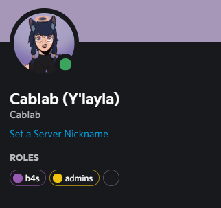

# stream-portrait-monitor

Shows or hides OBS Image sources when a Discord user is speaking or not speaking in a voice channel

## Purpose

This is a bot running locally that can join a Discord voice channel and detect when each user in the voice channel starts or stops talking. When the user starts talking, the bot makes visible a Source image in OBS that shows their FFXIV character portrait. Once the user stops talking, the bot hides their character portrait again.

Using this bot, you can have dynamic character portraits that show up only when a team member is talking, letting viewers associate a voice with your party member's character.

## Setup

There's a lot of setup required for this becuase it's running locally on a personal Discord Bot I made for a hobby project and haven't extended it out yet, but if you really want the functionality yourself, here's everything you'll have to do to get this working for you.

## Install Node.js

- Use the [Node.js Download](https://nodejs.org/en/download/) page to download and install Node.js. You'll need Node.js to run the bot and install its dependencies.

## Character Portraits 

Ultimately, you just need a different `Image` source in OBS for each person in your static that you want the bot to show/hide based on their state of speaking. Do this however you want, but here is how I did it:

### Example PSD

The template I used for my static's portraits can be found in [examples/StaticPortaits.psd](./examples/StaticPortraits.psd). You can use the file here to swap in the information for your static.

I pulled pictures of my static members from the [FFXIV Lodestone](https://na.finalfantasyxiv.com/lodestone/) website. You can sign in and see your own character's picture and search around to find your team members as well. Here's [my character's](https://na.finalfantasyxiv.com/lodestone/character/19913698/) page so you can see what it looks like. On the character page, I right clicked, chose `Open image in new tab`, went to the new tab, right clicked again, and chose `Save image as`.

Once you have the character image for each team member, use some kind of photo editing software to remove the nebulous blue background. Here are some image editing software options:

- [Photoshop](https://www.adobe.com/products/photoshop.html) is a popular program, but it requires a subscription
- [GIMP](https://www.gimp.org/) is an open-source, free program you can download
- [Photoepea](https://www.photopea.com/) is free and runs in an internet browser. It's incredibly similar to Photoshop if you have experience there and is a great option for lighter/simpler image editing

Get your characters portraits into the PSD template I included. When you like how they look, save a PNG format (PNG for the transparency) picture of each character/slot in the picture. I did this by hiding all of the Slot groups except for the one I was saving, then exporting the only visible character/slot as a PNG. Doing it this way allows you to very easily line everything back up in OBS, even though you'll be importing 8 different pictures.

### Import Into OBS

- Create an OBS `Image` source for each of the characters in your team and place them in whatever scene works for your setup
- Take note of the name of the `Scene` you placed them in and what you named the `Image Source` when creating it

As long as you've kept track of the name of the `Scene` all the portraits are in and the name of each individual `Image Source`, you're free to adjust how they look in OBS.

## Auth File

This bot runs locally on your own computer, but it requires a few confidential pieces of information that you'll have to create yourself since I don't want to share the private info in this public project repo. Here's the information you'll need:

- Discord Bot token (see [Discord Bot Setup](#discord-bot-setup))
- Local OBS Websocket password (see [OBS Websocket Plug-in](#obs-websocket-plug-in))
- Discord username of each static member you're setting this up to work with
  - These can be found by clicking a person's name in Discord and looking at the little pop-up profile. If you only see a single name, that's the Discord username. If you see two names, one big and one small, the bigger name is their server nickname and the smaller name underneath is the Discord username. Use the smaller Discord username

    

  - In the example above, my nickname in the server is `Cablab (Y'layla)`. The actual Discord username that should be used for this program is the smaller `Cablab` underneath.

Once you've got all of that information, create a file called `secrets.json` and structure it the same way I show in [examples/secrets.json](examples/secrets.json), replacing the placeholder information with what you prepared above. You'll use this file later on.

## OBS Websocket Plug-in

Download the OBS Websocket Plug-in. This allows our bot to connect to OBS and control the `Image` sources you added while it is running. Releases are available on the [Repo's releases page](https://github.com/Palakis/obs-websocket/releases). Once you've downloaded it, open OBS and you should be met with a first-time setup where you can create a password.

- Check the boxes for `Enable WebSockets server` and `Enable authentication`
- Enter `4444` into the `Server Port` box
- Create a password and put it in the `Password` box
- Also place the password you entered into the `secrets.json` file you created [above](#auth-file).

**Note:** If you forgot to create a password the first time you opened OBS after installation, you can create one by going to the OBS menu bar and selecting `Tools > WebSockets Server Settings`.

## Discord Bot Setup

Go to Discord's [Developer Page](https://discord.com/developers/applications/) to create a bot. Sign in (if needed) and hit the `New Application` button. Follow any prompts and you should eventually end up on your bot's information page at a URL that looks like `https://discord.com/developers/applications/{bot-id}/information`.

Click the `Bot` tab on the left to find the bot-specific information on a page at a URL that looks like `https://discord.com/developers/applications/{bot-id}/bot`. For the `secrets.json` file you created [above](#auth-file), you'll need the `Token` that can be copied or revealed next to your bot's Icon and underneath the bot's Username.

To invite the bot into the Discord server where you're going to use it, navigate to the `OAuth2` menu on the left (which should take you to a `https://discord.com/developers/applications/{bot-id}/oauth2` URL). In the `Scopes` box, choose `Bot`. In the `Bot Permissions` box that pops up, choose the permissions you want to give the bot in your Discord server. If you don't know what to give it, `Administrator` will make sure it has access to everything it needs.

**Note:** Be careful about granting a bot `Administrator` privileges! You may have to be the Discord Server owner to do so, you'll be granting the bot full permissions inside of your server. If you don't know what the bot is doing, this can have far-reaching consequences.

Once you've selected the necessary `Scopes` and `Bot Permissions`, a URL should have been generated for you at the bottom of the `Scopes` box. Click the `Copy` button on the right and paste that URL into a new browser tab. Select the server you want the bot to join.

## Using the Bot

- Clone this repo somewhere onto your local computer
- On a terminal prompt, navigate into the directory where you cloned the repo
- Run `npm install` in the repo's directory to install the bot's Node.js dependencies
- With OBS and Discord open, run `node bot.js` to start the bot
- Join a voice channel in your Discord server, then ask the bot to join by typing `!join` in any text channel the bot has access to
